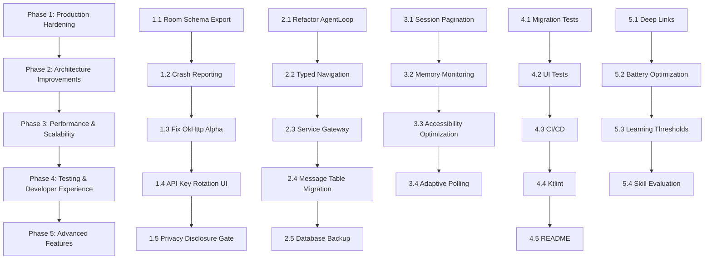

# XOmniClaw Development Roadmap — Phase 2

## Executive Summary

XOmniClaw has a solid foundation with well-structured code, comprehensive documentation, and thoughtful error handling. This roadmap prioritizes improvements based on impact, risk reduction, and user value. The plan addresses gaps identified in the architecture review while focusing on production readiness, scalability, and developer experience.

---

## Priority Framework

Each item is evaluated on:
- **Impact**: User value, security, stability
- **Urgency**: Risk of data loss, security vulnerabilities, or production failures
- **Effort**: Relative complexity (low/medium/high)

---

## Phase 1: Production Hardening (Weeks 1–3)

### 1.1 Enable Room Schema Export

**Priority**: High  
**Effort**: Low  

**Why**: Without schema export, database migrations become fragile and untrackable.

**Changes**:
- Update [`AppDatabase.kt`](app/src/main/java/com/omniclaw/app/data/local/AppDatabase.kt:17): `exportSchema = true`
- Add migration tests to verify v1→v2→v3→v4 transitions
- Commit generated schemas under `migrations/` directory

**Files**:
- [`AppDatabase.kt`](app/src/main/java/com/omniclaw/app/data/local/AppDatabase.kt:17)

---

### 1.2 Add Crash Reporting Integration

**Priority**: High  
**Effort**: Low  

**Why**: Firebase Crashlytics is already included but not configured for production builds.

**Changes**:
- Verify Crashlytics plugin is active in release builds
- Add custom non-fatal error logging for agent loop failures
- Track LLM API errors, accessibility service disconnections, vision pipeline failures
- Configure symbol upload for native crash analysis

**Files**:
- [`AgentLoop.kt`](app/src/main/java/com/omniclaw/app/agent/AgentLoop.kt:248) — add Crashlytics.log() calls
- [`VisionPipeline.kt`](app/src/main/java/com/omniclaw/app/vision/VisionPipeline.kt:100) — log retry failures
- [`OmniAccessibilityService.kt`](app/src/main/java/com/omniclaw/app/service/OmniAccessibilityService.kt:66) — log interruption events

---

### 1.3 Fix OkHttp Alpha Dependency

**Priority**: High  
**Effort**: Low  

**Why**: OkHttp 5.0.0-alpha.16 may have breaking changes or stability issues.

**Changes**:
- Update [`gradle/libs.versions.toml`](gradle/libs.versions.toml:15): `okhttp = "4.12.0"` (stable)
- Test all HTTP calls: LLM client, VLM client, Gemini client, STT
- Verify compatibility with current API usage

**Files**:
- [`libs.versions.toml`](gradle/libs.versions.toml:15)
- [`LlmClient.kt`](app/src/main/java/com/omniclaw/app/data/llm/LlmClient.kt:53)
- [`VlmClient.kt`](app/src/main/java/com/omniclaw/app/vision/VlmClient.kt:109)

---

### 1.4 Implement API Key Rotation UI

**Priority**: Medium  
**Effort**: Low  

**Why**: SecureStorage already tracks rotation metadata but has no UI.

**Changes**:
- Add "Rotate API Keys" option in Settings → Privacy
- Show last rotation date per key
- Trigger re-authentication flow when keys expire
- Log rotation events to Crashlytics

**Files**:
- [`SettingsScreen.kt`](app/src/main/java/com/omniclaw/app/ui/settings/SettingsScreen.kt) — add rotation section
- [`SecureStorage.kt`](app/src/main/java/com/omniclaw/app/data/prefs/SecureStorage.kt:136) — already has `needsRotation()`

---

### 1.5 Add Privacy Disclosure Gate

**Priority**: High  
**Effort**: Low  

**Why**: App sends screenshots and prompts to external LLM APIs without explicit consent flow.

**Changes**:
- Show modal on first launch explaining data collection
- Require user acceptance before first LLM call
- Store acceptance flag in DataStore (already exists: [`privacyAccepted`](app/src/main/java/com/omniclaw/app/data/prefs/SettingsRepository.kt:143))
- Display privacy notice in Settings

**Files**:
- [`SettingsRepository.kt`](app/src/main/java/com/omniclaw/app/data/prefs/SettingsRepository.kt:143) — already has `privacyAccepted` flow
- [`MainActivity.kt`](app/src/main/java/com/omniclaw/app/MainActivity.kt:59) — check on startup
- Create new `PrivacyDialog.kt` component

---

## Phase 2: Architecture Improvements (Weeks 4–6)

### 2.1 Refactor AgentLoop State Management

**Priority**: Medium  
**Effort**: Medium  

**Why**: Singleton with mutable state creates testing and race condition risks.

**Current Issue**:
[`AgentLoop.kt`](app/src/main/java/com/omniclaw/app/agent/AgentLoop.kt:71) maintains `runningJobs`, `stopSet`, `activeCount` as mutable state.

**Proposed Solution**:
```kotlin
@Singleton
class AgentLoopManager {
    private val sessionManagers = ConcurrentHashMap<String, SessionAgent>()
    
    fun startSession(session: Session, prompt: String): Job { ... }
    fun stopSession(sessionId: String) { ... }
}
```

**Files**:
- [`AgentLoop.kt`](app/src/main/java/com/omniclaw/app/agent/AgentLoop.kt:71) — refactor to manager pattern
- Create `SessionAgent.kt` — per-session state isolation

---

### 2.2 Add Typed Navigation Routes

**Priority**: Medium  
**Effort**: Low  

**Why**: String-based navigation is error-prone and breaks on refactoring.

**Current Issue**:
[`NavGraph.kt`](app/src/main/java/com/omniclaw/app/core/nav/NavGraph.kt:130) uses `"chat?sessionId=$id"`.

**Proposed Solution**:
```kotlin
@Serializable
data class ChatRoute(val sessionId: String? = null)

navController.navigate(ChatRoute(sessionId = id))
```

**Files**:
- [`NavGraph.kt`](app/src/main/java/com/omniclaw/app/core/nav/NavGraph.kt:51) — convert sealed class to @Serializable
- Update all navigation calls

---

### 2.3 Extract Service Gateway Layer

**Priority**: Medium  
**Effort**: Medium  

**Why**: AgentLoop directly references multiple services, creating tight coupling.

**Current Issue**:
[`AgentLoop.kt`](app/src/main/java/com/omniclaw/app/agent/AgentLoop.kt:28-30) imports `AgentForegroundService`, `HaloOverlayService`, `ScreenCaptureService`.

**Proposed Solution**:
```kotlin
interface ServiceGateway {
    suspend fun startForegroundService()
    suspend fun showHaloStatus(text: String)
    suspend fun captureScreen(): ByteArray?
}
```

**Files**:
- Create [`gateway/ServiceGateway.kt`](app/src/main/java/com/omniclaw/app/gateway/) — new abstraction
- Refactor [`AgentLoop.kt`](app/src/main/java/com/omniclaw/app/agent/AgentLoop.kt:28-30) to use gateway

---

### 2.4 Migrate Session Messages to Separate Table

**Priority**: Medium  
**Effort**: High  

**Why**: Storing entire message lists in JSON string prevents efficient querying and pagination.

**Current Issue**:
[`Entities.kt`](app/src/main/java/com/omniclaw/app/data/local/Entities.kt:26): `val messagesJson: String`

**Proposed Solution**:
```kotlin
@Entity(tableName = "chat_messages")
data class ChatMessageEntity(
    @PrimaryKey val id: String,
    val sessionId: String,
    val role: String,
    val content: String,
    val timestamp: Long,
    val toolCallId: String?,
)
```

**Migration Steps**:
1. Add `chat_messages` table in v4 migration
2. Migrate existing sessions: extract JSON messages into rows
3. Update [`SessionDao`](app/src/main/java/com/omniclaw/app/data/local/Daos.kt:10), [`SessionRepository`](app/src/main/java/com/omniclaw/app/data/session/SessionRepository.kt:52)
4. Add pagination queries

**Files**:
- [`Entities.kt`](app/src/main/java/com/omniclaw/app/data/local/Entities.kt:26) — add `ChatMessageEntity`
- [`Daos.kt`](app/src/main/java/com/omniclaw/app/data/local/Daos.kt:10) — add message DAO
- [`AppDatabase.kt`](app/src/main/java/com/omniclaw/app/data/local/AppDatabase.kt:14) — migration v3→v4
- [`SessionRepository.kt`](app/src/main/java/com/omniclaw/app/data/session/SessionRepository.kt:52) — rewrite appendMessage/getById

---

### 2.5 Add Database Backup Strategy

**Priority**: Low  
**Effort**: Medium  

**Why**: No user-visible backup mechanism for session history and memories.

**Proposed Solution**:
- Automated encrypted export to filesDir on schedule
- Manual export/import via Settings → Privacy
- Integrate with Android's built-in backup API (API 23+)

**Files**:
- Create [`data/backup/DatabaseBackupManager.kt`]
- [`SettingsScreen.kt`](app/src/main/java/com/omniclaw/app/ui/settings/SettingsScreen.kt) — add backup options

---

## Phase 3: Performance & Scalability (Weeks 7–9)

### 3.1 Implement Pagination for Sessions List

**Priority**: Medium  
**Effort**: Low  

**Why**: Loading all sessions into memory for every UI composition becomes expensive.

**Current Issue**:
[`Daos.kt`](app/src/main/java/com/omniclaw/app/data/local/Daos.kt:12): `SELECT * FROM sessions ORDER BY lastActiveAt DESC`

**Proposed Solution**:
```kotlin
@Query("SELECT * FROM sessions ORDER BY lastActiveAt DESC LIMIT :limit OFFSET :offset")
fun observePaginated(limit: Int, offset: Int): Flow<List<SessionEntity>>
```

**Files**:
- [`Daos.kt`](app/src/main/java/com/omniclaw/app/data/local/Daos.kt:11) — add paginated query
- [`SessionsScreen.kt`](app/src/main/java/com/omniclaw/app/ui/sessions/SessionsScreen.kt) — implement lazy loading
- [`SessionsViewModel.kt`](app/src/main/java/com/omniclaw/app/ui/sessions/SessionsViewModel.kt) — handle pagination state

---

### 3.2 Add Memory Pressure Monitoring

**Priority**: Medium  
**Effort**: Low  

**Why**: Multiple singleton services running concurrently could cause OOM on low-memory devices.

**Proposed Solution**:
```kotlin
class MemoryMonitor @Inject constructor(@ApplicationContext ctx: Context) {
    fun isLowMemory(): Boolean {
        val memInfo = ActivityManager.MemoryInfo()
        return Runtime.getRuntime().totalMemory() - Runtime.getRuntime().freeMemory() > 100 * 1024 * 1024
    }
    
    fun releaseCaches() {
        visionCache.clear()
        bitmapPool.clear()
    }
}
```

**Files**:
- Create [`core/MemoryMonitor.kt`]
- Update [`VisionCache.kt`](app/src/main/java/com/omniclaw/app/vision/VisionCache.kt:59) — expose clear method
- [`AgentLoop.kt`](app/src/main/java/com/omniclaw/app/agent/AgentLoop.kt:235) — check before vision fallback
- [`OmniApplication.kt`](app/src/main/java/com/omniclaw/app/OmniApplication.kt) — register listener

---

### 3.3 Optimize Accessibility Tree Traversal

**Priority**: Medium  
**Effort**: Medium  

**Why**: Current traversal caps at 200 children per node but doesn't prune early on depth or irrelevant nodes.

**Current Issue**:
[`OmniAccessibilityService.kt`](app/src/main/java/com/omniclaw/app/service/OmniAccessibilityService.kt:99) — `appendNode()` traverses up to depth 50.

**Proposed Solution**:
- Add depth limit based on node type (skip deep nested layouts)
- Prune non-interactive nodes earlier
- Cache fingerprints for unchanged trees
- Profile with Android Studio Profiler

**Files**:
- [`OmniAccessibilityService.kt`](app/src/main/java/com/omniclaw/app/service/OmniAccessibilityService.kt:99) — optimize traversal
- [`AccessibilityDiagnostics.kt`](app/src/main/java/com/omniclaw/app/accessibility/AccessibilityDiagnostics.kt) — add metrics

---

### 3.4 Add Adaptive Polling for Agent Loop

**Priority**: Low  
**Effort**: Medium  

**Why**: Fixed 400ms delay + 1.5s stabilization cap may be too slow or too fast depending on device.

**Current Issue**:
[`AgentLoop.kt`](app/src/main/java/com/omniclaw/app/agent/AgentLoop.kt:631-648) — hardcoded delays.

**Proposed Solution**:
- Measure actual stabilization time over last 5 actions
- Use moving average for next delay (min 200ms, max 800ms)
- Allow user override in Settings

**Files**:
- [`AgentLoop.kt`](app/src/main/java/com/omniclaw/app/agent/AgentLoop.kt:631) — adaptive delay logic
- [`SettingsRepository.kt`](app/src/main/java/com/omniclaw/app/data/prefs/SettingsRepository.kt:118) — add `adaptiveDelay` pref

---

## Phase 4: Testing & Developer Experience (Weeks 10–12)

### 4.1 Add Integration Tests for Database Migrations

**Priority**: Medium  
**Effort**: Medium  

**Why**: No tests verify migrations work correctly with real data.

**Proposed Solution**:
```kotlin
@Test
fun migration_1_to_2_preserves_sessions() {
    // Create v1 DB, migrate to v2, verify sessions intact
}

@Test
fun migration_2_to_3_adds_indexes() {
    // Create v2 DB, migrate to v3, verify indexes exist
}
```

**Files**:
- Create [`src/androidTest/java/com/omniclaw/app/data/local/MigrationTests.kt`]
- Use `Room.inMemoryDatabaseBuilder()` for isolated tests

---

### 4.2 Add Compose UI Tests

**Priority**: Medium  
**Effort**: Medium  

**Why**: No automated UI testing for chat rendering, settings persistence, navigation.

**Proposed Solution**:
```kotlin
@Test
fun chatScreen_displaysMessages() {
    composeTestRule.setContent {
        ChatScreen(sessionId = "test")
    }
    composeTestRule.onNodeWithText("Hello").assertIsDisplayed()
}

@Test
fun settings_screen_persistsTtsToggle() {
    // Toggle TTS, restart, verify persisted
}
```

**Files**:
- Create [`src/androidTest/java/com/omniclaw/app/ui/chat/ChatScreenTest.kt`]
- Create [`src/androidTest/java/com/omniclaw/app/ui/settings/SettingsScreenTest.kt`]
- Enable `isComposeExperimentalApi` in test config

---

### 4.3 Set Up CI/CD Pipeline

**Priority**: Low  
**Effort**: Medium  

**Why**: No automated build/test on pull requests.

**Proposed Solution**:
GitHub Actions workflow:
```yaml
name: CI
on: [push, pull_request]
jobs:
  test:
    runs-on: ubuntu-latest
    steps:
      - uses: actions/checkout@v4
      - uses: actions/setup-java@v4
        with:
          java-version: '21'
          distribution: 'temurin'
      - run: ./gradlew test
      - run: ./gradlew assembleDebug
```

**Files**:
- Create `.github/workflows/ci.yml`
- Add `gradle.properties` CI flags
- Configure Firebase Test Lab for instrumented tests

---

### 4.4 Add Code Style Enforcement

**Priority**: Low  
**Effort**: Low  

**Why**: No linter configuration for Kotlin code style.

**Proposed Solution**:
```kotlin
// build.gradle.kts
plugins {
    id("org.jlleitschuh.gradle.ktlint") version "12.1.0"
}
```

**Files**:
- [`build.gradle.kts`](build.gradle.kts) — add ktlint plugin
- [`gradle/libs.versions.toml`](gradle/libs.versions.toml) — add ktlint version
- Create `.editorconfig` with Kotlin rules

---

### 4.5 Create Project README

**Priority**: Low  
**Effort**: Low  

**Why**: No documentation for developers setting up the project.

**Content**:
- Architecture overview (agent loop, data layer, UI layer)
- Development environment setup (Android Studio, JDK 21, Gradle)
- Build instructions (`./gradlew assembleDebug`)
- Testing guidelines (`./gradlew test`, `./gradlew connectedInstrumentTest`)
- Key directories and file purposes

**Files**:
- Create [`README.md`](README.md)

---

## Phase 5: Advanced Features (Weeks 13–16)

### 5.1 Deep Link Support

**Priority**: Low  
**Effort**: Medium  

**Why**: Chat route supports `?sessionId={sessionId}` but no manifest deep link config.

**Proposed Solution**:
```xml
<intent-filter android:autoVerify="true">
    <action android:name="android.intent.action.VIEW" />
    <category android:name="android.intent.category.DEFAULT" />
    <category android:name="android.intent.category.BROWSABLE" />
    <data android:scheme="https" android:host="omniclaw.app" android:pathPrefix="/session/" />
</intent-filter>
```

**Files**:
- [`AndroidManifest.xml`](app/src/main/AndroidManifest.xml) — add intent filters
- [`DeepLinkManager.kt`](app/src/main/java/com/omniclaw/app/deeplink/DeepLinkManager.kt) — parse URLs

---

### 5.2 Add Battery Optimization Exemption

**Priority**: Low  
**Effort**: Low  

**Why**: Foreground service with continuous monitoring drains battery; users may kill the app.

**Proposed Solution**:
```kotlin
if (Build.VERSION.SDK_INT >= Build.VERSION_CODES.M) {
    val pm = ctx.getSystemService(Context.POWER_SERVICE) as PowerManager
    if (!pm.isIgnoringBatteryOptimizations(pkgName)) {
        val intent = Intent(Settings.ACTION_REQUEST_IGNORE_BATTERY_OPTIMIZATIONS).apply {
            data = Uri.parse("package:$pkgName")
            flags = Intent.FLAG_ACTIVITY_NEW_TASK
        }
        ctx.startActivity(intent)
    }
}
```

**Files**:
- Create [`core/BatteryOptimizationHelper.kt`]
- [`AgentForegroundService.kt`](app/src/main/java/com/omniclaw/app/service/AgentForegroundService.kt) — request exemption
- [`SettingsScreen.kt`](app/src/main/java/com/omniclaw/app/ui/settings/SettingsScreen.kt) — explain why needed

---

### 5.3 Enhance LearningEngine with Confidence Thresholds

**Priority**: Low  
**Effort**: Medium  

**Why**: Lessons are injected without confidence validation, potentially injecting low-quality guidance.

**Current Issue**:
[`LearningEngine.kt`](app/src/main/java/com/omniclaw/app/agent/learning/LearningEngine.kt:66) — injects all matching lessons.

**Proposed Solution**:
```kotlin
suspend fun lessonsForPrompt(screenFingerprint: String, minConfidence: Int = 2): String? {
    val lessons = lessonDao.forScreen(screenFingerprint, limit = 5, minConfidence = minConfidence)
    // ...
}
```

**Files**:
- [`LearningEngine.kt`](app/src/main/java/com/omniclaw/app/agent/learning/LearningEngine.kt:66) — add threshold
- [`Daos.kt`](app/src/main/java/com/omniclaw/app/data/local/Daos.kt:77) — update query
- [`AgentLoop.kt`](app/src/main/java/com/omniclaw/app/agent/AgentLoop.kt:943) — pass threshold

---

### 5.4 Add Skill Evaluation Framework

**Priority**: Low  
**Effort**: High  

**Why**: No metrics to track learning engine effectiveness over time.

**Proposed Solution**:
```kotlin
interface LearningEvaluator {
    fun evaluateLesson(lesson: LessonEntity): LessonQualityScore
    fun trackImprovementMetrics(sessionId: String)
}

data class LessonQualityScore(
    val accuracy: Float,      // % of times lesson was applied correctly
    val relevance: Float,     // % of times lesson was relevant to screen
    val successRate: Float,   // % of sessions improved after applying lesson
)
```

**Files**:
- Create [`agent/learning/LearningEvaluator.kt`]
- [`LearningEngine.kt`](app/src/main/java/com/omniclaw/app/agent/learning/LearningEngine.kt:142) — integrate evaluation
- [`LessonsViewModel.kt`](app/src/main/java/com/omniclaw/app/ui/memory/LessonsViewModel.kt) — display metrics

---

## Implementation Order



---

## Key Dependencies

- **Phase 2.4 (Message Table Migration)** depends on Phase 1.1 (Schema Export)
- **Phase 4.1 (Migration Tests)** depends on Phase 2.4 (New Schema)
- **Phase 4.3 (CI/CD)** can run in parallel with any phase
- **Phase 5.4 (Skill Evaluation)** depends on Phase 5.3 (Learning Thresholds)

---

## Success Metrics

After completing all phases:

1. **Stability**: Zero critical crashes in production (tracked via Crashlytics)
2. **Security**: All API keys rotated within 90 days, privacy disclosure enforced
3. **Performance**: Sessions list loads <100ms even with 1000+ entries (pagination)
4. **Maintainability**: 80%+ test coverage for core logic, CI passes on every PR
5. **Scalability**: Database schema tracked in version control, migrations tested

---

## Notes

- **Do not skip Phase 1** — these are production-readiness items that reduce risk immediately.
- **Phase 2.4 (Message Table Migration)** is high-effort but pays dividends long-term.
- **Phase 4 (Testing)** should begin early where possible (e.g., CI/CD can start in Week 4).
- **Phase 5 features** are nice-to-have and can be deferred if resources are limited.

---

## Conclusion

This roadmap transforms XOmniClaw from a well-architected prototype into a production-ready application. The focus is on:

1. **Reducing risk**: Crash reporting, schema export, OkHttp stable version
2. **Improving maintainability**: Typed routes, service gateway, message table normalization
3. **Enhancing performance**: Pagination, memory monitoring, adaptive polling
4. **Building confidence**: Integration tests, UI tests, CI/CD pipeline

Start with Phase 1 items — they require minimal effort and provide immediate value. Then move to Phase 2 architecture improvements before scaling to production deployment.
